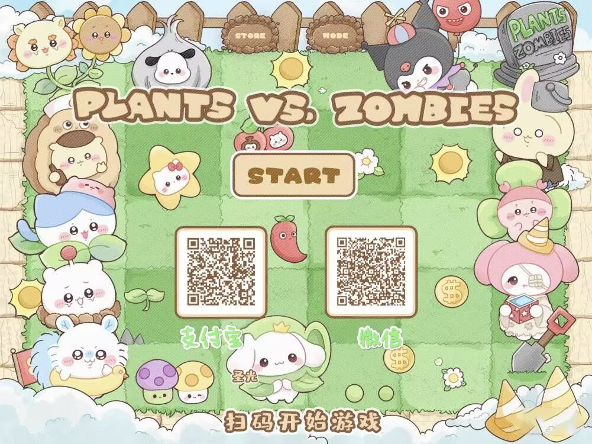

# 守望先锋 B 站直播挂宝 / Overwatch Bilibili Live Drops Guard

当前版本：`v0.3.6`

开源地址：<https://github.com/taocihei/overwatch-bilibili-drops-guard>

## 重要声明

本软件完全免费。如果你是购买得到的，请立即联系商家退款。

赞助没有任何功能效果，不会解锁功能、不会提高成功率、不会获得优先支持，也不会影响掉宝或领奖结果。赞助只相当于给作者点了一次赞。

本工具只是本机辅助观看和检查任务状态。请自行遵守 B 站活动规则和账号使用规则。掉宝是否到账取决于 B 站活动规则、账号资格、直播间活动状态和平台接口变化。

## 这个软件做什么

这是一个给守望先锋 B 站直播掉宝活动使用的桌面工具。

它会通过本机 Edge 或 Chrome 获取你的 B 站登录 Cookie，然后在后台发送直播观看计时请求。正式挂宝时不会打开一堆直播间浏览器窗口。程序会定时检查直播间、任务进度和领奖状态，任务完成后可以自动领取，也可以手动点击领取。

默认直播间是守望先锋赛事直播间：`23612045`。

## 普通用户下载使用

1. 打开项目页面：<https://github.com/taocihei/overwatch-bilibili-drops-guard>
2. 进入右侧或页面中的 `Releases`。
3. 下载 `OverwatchBiliDrops.exe`。
4. 双击运行。
5. 如果 Windows 提示“未知发布者”或“Windows 已保护你的电脑”，点击“更多信息”，再点“仍要运行”。这是个人开源软件常见提示，不代表一定有病毒。
6. 第一次使用先点“自动获取 Cookie”，在弹出的独立 Edge/Chrome 窗口里登录 B 站。
7. 登录成功后，软件会自动回填 Cookie 并关闭登录窗口。
8. 可以点“保存账号”保存当前 Cookie，之后用账号下拉切换。
9. 直播间默认已填好，直接点“开始挂宝”即可。
10. 在“任务进度”里看还差多少分钟、是否已完成、是否已领取。

如果 `Releases` 里暂时没有安装包，说明作者还没有上传新版 EXE，可以按下面的“源码运行”方式启动。

## 界面怎么用

- `自动获取 Cookie`：推荐使用。程序会拉起独立 Edge/Chrome，你登录 B 站后自动回填。
- `只打开登录页`：只帮你打开 B 站登录页，不自动读取 Cookie。适合排查浏览器打不开的问题。
- `当前账号 / 账号名称`：用来切换多个 B 站账号。获取 Cookie 后点“保存账号”，下次可直接从下拉框切换。
- `直播间号或链接`：默认 `23612045`。也可以粘贴完整直播间链接，保存后会自动变成数字房间号。
- `检查间隔`：多久检查一次任务进度。默认 10 秒。
- `后台观看线程数`：用来加速累计观看时长。当前最多支持 `100` 路后台计时；软件不会打开 100 个直播窗口，而是提交后台观看计时请求。不要设置过大，避免账号或网络异常。
- `自动领奖`：开启后，任务满足条件会自动领取。领奖固定只用 1 个线程，避免请求太快失败。
- `任务 ID`：通常留空。程序会自动从活动页读取任务，不需要用户手填。自动识别失败时，可以按下面“手动获取直播间号和任务 ID”填写。
- `通知 URL`：可留空。填写后，启动、检测到可领取、领取成功、领取失败、Cookie 获取成功等关键事件会向该地址发送 JSON POST。
- `任务进度`：优先显示本次可挂的日期和奖励，比如“还差 48 分钟”“已完成，待领取”“已领取”。
- `运行日志`：只保留辅助记录，主要结果请看任务进度。

## 手动获取直播间号和任务 ID

大多数情况下不需要手动获取，软件会自动识别。只有出现“任务进度一直无数据”“任务 ID 获取失败”时，再按这里操作。

### 手动获取直播间号

1. 打开有当前掉宝活动的 B 站直播间。
2. 复制浏览器地址栏里的链接。
3. 取 `live.bilibili.com/` 后面的数字。

例如：

```text
https://live.bilibili.com/23612045?live_from=82002
```

软件里只需要填写：

```text
23612045
```

### 手动获取任务 ID

任务 ID 用来查询任务进度和领取奖励。通常软件会自动从直播页读取；如果自动失败，可以手动复制。

1. 用浏览器登录 B 站。
2. 打开有当前掉宝任务的直播间或活动页面。
3. 按 `F12` 打开开发者工具。
4. 切到 `网络 / Network`。
5. 刷新页面，搜索 `totalv2` 或 `task`。
6. 找到类似下面的请求：

```text
https://api.bilibili.com/x/task/totalv2?task_ids=...
```

7. 复制 `task_ids=` 后面的内容，粘贴到软件的“任务 ID”输入框。
8. 如果有多个任务 ID，用英文逗号分隔。

任务 ID 通常长这样：

```text
6ERAcwloghvqrb00,6ERAcwloghvqnk00,6ERAcwloghvql500
```

如果找不到 `totalv2` 请求，也可以在页面源码或网络响应里搜索 `taskId`，复制对应的任务 ID。

## 常见问题

### 1. 点“自动获取 Cookie”没有弹出浏览器

先点“只打开登录页”测试本机 Edge/Chrome 是否能正常打开 B 站。

如果仍然失败，请确认电脑已安装 Edge 或 Chrome，并关闭可能拦截浏览器启动的安全软件。

### 2. 已经登录 B 站，但软件还是说 Cookie 获取失败

重新点一次“自动获取 Cookie”，在弹出的独立浏览器里完成登录后等几秒。

如果还是失败，可以手动复制 Cookie。Cookie 至少需要包含 `SESSDATA`，领奖通常还需要 `bili_jct`。缺少 `bili_jct` 时，软件会提示重新获取 Cookie。

### 3. 任务进度一直不变

先确认直播间正在直播，并且活动规则允许当前账号参与掉宝。

如果刚开始挂宝，请等待一个检查周期。默认每 10 秒检查一次。多开后台观看线程后，进度也需要等 B 站接口刷新，不会每秒变化。

### 4. 怎么切换多个账号

每个账号都需要单独获取一次 Cookie。

1. 在“账号名称”里填一个好记的名字，比如 `主账号`。
2. 点“自动获取 Cookie”，登录对应的 B 站账号。
3. 回填成功后点“保存账号”。
4. 换另一个账号名，重复获取并保存。
5. 之后从“当前账号”下拉框选择即可切换。

切换账号后，如果正在挂宝，请先停止再重新开始。已经运行中的后台计时会继续使用启动时的账号 Cookie。

### 5. 通知 URL 怎么用

通知 URL 是给进阶用户或自用机器人用的 Webhook。留空不影响使用。

程序会发送 `POST` 请求，内容是 JSON：

```json
{
  "title": "守望先锋 B 站直播挂宝",
  "message": "已领取：某个奖励",
  "level": "info",
  "source": "OverwatchBiliDrops"
}
```

如果通知发送失败，只会写入运行日志，不会影响挂宝和领奖。

### 6. 软件提示“还差多少分钟”和 B 站页面不一致

B 站活动页和接口刷新可能有延迟。可以等待 1 到 2 个检查周期，或者停止后重新开始。

后续活动可能按日期、页签、任务批次更新，软件会尝试每次检查时重新读取最新任务，不会把任务日期写死。

### 7. 显示“已完成，待领取”，但没有立刻领取

自动领奖开启时，软件会按顺序一个一个领取。领奖固定只用 1 个线程。

如果 B 站提示操作太快，软件会等待后自动重试。你也可以稍后点“领取奖励”手动再试。

### 8. 领取失败，提示重新获取 Cookie

这通常表示登录信息过期、不完整，或者 Cookie 里缺少 `bili_jct`。

点“自动获取 Cookie”重新登录一次，然后再开始挂宝或点击领取。

### 9. 领取失败，提示 B 站操作太快

这是 B 站限频。不要连续点领取。等待一会儿后再试，软件也会自动放慢领取速度。

### 10. 打开软件闪退

到下面目录查看错误日志：

```text
%APPDATA%\OverwatchBiliDrops\crash.log
```

把 `crash.log` 内容发到 GitHub Issues，或者发给作者定位。

### 11. 杀毒软件报毒

这是 Python + PyInstaller 打包的单文件 EXE，个人开源软件可能被误报。你可以从源码运行，或自行查看代码后本地打包。

## 源码运行

需要电脑已安装 Python 3.11 或更新版本。

```powershell
python -m pip install -r requirements.txt
python app.py
```

## 自己打包

```powershell
python -m pip install -r requirements.txt
powershell -ExecutionPolicy Bypass -File .\build.ps1
```

打包后的程序在：

```text
dist\OverwatchBiliDrops.exe
```
## 赞助

如果这个工具帮到了你，可以扫码赞助。

再次说明：赞助没有任何功能效果，不会解锁功能、不会提高成功率、不会获得优先支持，也不会影响掉宝或领奖结果。它只是给作者点了一次赞。

二维码已核对：左侧是支付宝，右侧是微信。



---

# English Guide

Project name: **守望先锋 B 站直播挂宝 / Overwatch Bilibili Live Drops Guard**

Version: `v0.3.6`

Repository: <https://github.com/taocihei/overwatch-bilibili-drops-guard>

This software is completely free. If you paid for it, please ask the seller for a refund.

Sponsorship has no functional effect. It does not unlock features, improve success rate, provide priority support, or affect drop/reward results. It is only a way to give the author a thumbs-up.

## What It Does

This is a Windows desktop helper for Overwatch Bilibili live drop tasks.

It opens your local Edge or Chrome browser to capture Bilibili login cookies. During guarding, it sends background live heartbeat requests to accumulate watch time, checks task progress, and claims completed rewards. It does not open multiple visible live-room browser windows.

Default room: `23612045`.

## Download And Use

1. Open the repository page: <https://github.com/taocihei/overwatch-bilibili-drops-guard>
2. Open `Releases`.
3. Download `OverwatchBiliDrops.exe`.
4. Double-click to run it.
5. If Windows shows an unknown-publisher warning, click `More info`, then `Run anyway`.
6. Click `自动获取 Cookie` and sign in to Bilibili in the opened Edge/Chrome window.
7. The app will fill the Cookie automatically after login.
8. Click `保存账号` if you want to keep this account profile and switch accounts later.
9. Keep the default room or enter another live-room ID/URL.
10. Click `开始挂宝`.
11. Check `任务进度` for remaining minutes, claimable rewards, and claimed rewards.

## Common Problems

- Browser does not open: make sure Edge or Chrome is installed, then try `只打开登录页`.
- Cookie capture fails: sign in again with `自动获取 Cookie`. Reward claiming usually requires `bili_jct`.
- Multiple accounts: capture Cookie once for each account, name it, then switch from the account dropdown.
- Notification URL: optional webhook. The app sends JSON POST messages for important events such as claim success or failure.
- Progress does not change: wait for one or two check intervals and confirm the live room is active.
- Claim fails because requests are too frequent: wait and retry later. The app slows down automatic claiming.
- App crashes: check `%APPDATA%\OverwatchBiliDrops\crash.log` and report it in GitHub Issues.
- Antivirus warning: PyInstaller single-file apps may be falsely flagged. You can inspect the source and run from source.

## Run From Source

```powershell
python -m pip install -r requirements.txt
python app.py
```

## Build

```powershell
python -m pip install -r requirements.txt
powershell -ExecutionPolicy Bypass -File .\build.ps1
```

The executable will be generated at:

```text
dist\OverwatchBiliDrops.exe
```
