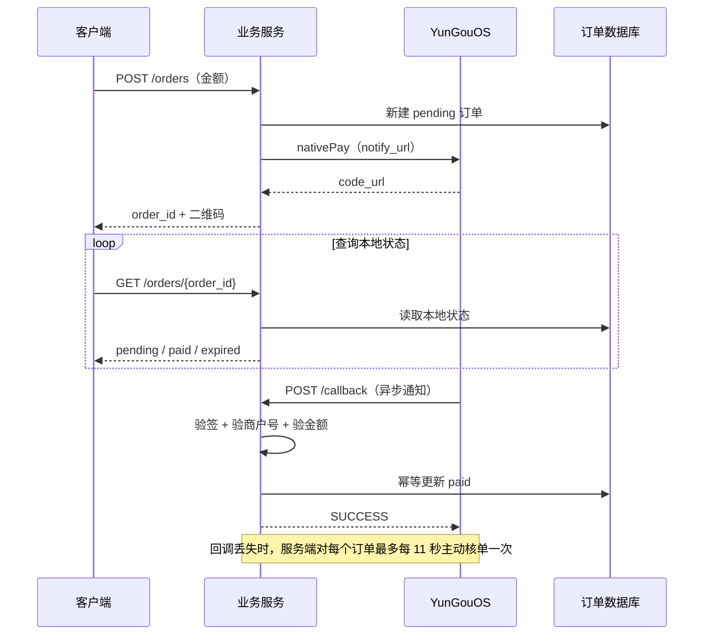

# YunGouOS 扫码支付接入与“支付后无反馈”补偿方案

> 适用场景：Windows 桌面程序、Web 前端或其他客户端展示 YunGouOS Native Pay 二维码，支付完成后需要自动更新界面。
> 编写日期：2026-08-05

## 1. 结论

Native Pay 的二维码不是浏览器收银台页面，用户在微信中完成付款后，原桌面窗口不会依靠页面跳转“自动返回”。正确链路是：

1. 业务服务创建本地订单并调用 YunGouOS Native Pay；
2. 客户端只轮询自己的订单状态接口；
3. YunGouOS 异步通知业务服务，业务服务验签、验金额并把本地订单改为 `paid`；
4. 客户端下一次查询本地状态时更新 UI；
5. 异步通知丢失时，由业务服务限频调用 YunGouOS 查询订单接口核单。

本项目“付款完成但界面无反馈”的主要原因是：回调地址使用 `chatgpt.site` 域名，而 YunGouOS 官方文档要求回调域名完成 ICP 备案，平台可能拦截通知。旧实现又只查询本地数据库，没有主动核单补偿，因此订单会一直停留在 `pending`。

## 2. 标准架构



## 3. YunGouOS 关键接口

### 3.1 Native Pay

- 地址：`https://api.pay.yungouos.com/api/pay/wxpay/nativePay`
- 方法：`POST`
- `Content-Type`：`application/x-www-form-urlencoded;charset=UTF-8`
- 参与签名的必填字段：`body`、`mch_id`、`out_trade_no`、`total_fee`
- 常用业务字段：`notify_url`、`attach`
- `type=1`：返回 `code_url`，由业务方本地生成二维码

### 3.2 异步通知

YunGouOS 支付成功后向 `notify_url` 发起表单 `POST`。参与签名字段为：

- `code`
- `orderNo`
- `outTradeNo`
- `payNo`
- `money`
- `mchId`

处理成功必须原样返回大写字符串：

```text
SUCCESS
```

通知可能重复发送，更新数据库必须幂等。官方说明失败通知最多重试 15 次；不要把同一通知处理成多笔业务。

### 3.3 主动查询订单

- 地址：`https://api.pay.yungouos.com/api/system/order/getPayOrderInfo`
- 方法：`GET`
- 参数：`out_trade_no`、`mch_id`、`sign`
- 频率限制：**1 次 / 10 秒**
- 关键返回：`data.outTradeNo`、`data.mchid`、`data.payNo`、`data.money`、`data.payStatus`
- `payStatus=0` 表示未支付，`payStatus=1` 表示已支付

主动查询只能作为回调丢失时的补偿，客户端不得直接高频调用该接口。

## 4. 签名算法

1. 只选择规定参与签名的字段；
2. 按字段名 ASCII 升序排序；
3. 拼接为 `key=value&key=value`；
4. 末尾追加 `&key=支付密钥`；
5. UTF-8 编码后计算 MD5，并转大写。

```ts
import { createHash } from "node:crypto";

export function paymentSign(
  params: Record<string, string>,
  paymentKey: string,
): string {
  const payload = Object.entries(params)
    .filter(([, value]) => value !== "")
    .sort(([a], [b]) => (a === b ? 0 : a < b ? -1 : 1))
    .map(([key, value]) => `${key}=${value}`)
    .concat(`key=${paymentKey}`)
    .join("&");

  return createHash("md5")
    .update(payload, "utf8")
    .digest("hex")
    .toUpperCase();
}
```

支付密钥不能放进桌面程序、浏览器 JavaScript、日志或接口响应中；签名只能在服务端完成。

## 5. 回调实现要点

```ts
export async function POST(request: Request): Promise<Response> {
  const body = await request.text();
  if (!body || body.length > 8192) return text("FAIL", 413);
  const values = new URLSearchParams(body);

  if (!verifySignature(values)) return text("FAIL", 400);
  const order = await findByProviderOrderNo(values.get("outTradeNo") ?? "");
  if (!order) return text("FAIL", 404);

  const paidCents = moneyToCents(values.get("money"));
  if (paidCents !== order.amountCents) return text("FAIL", 400);

  if (values.get("code") === "1") {
    await markPaidIfPending(order.id, values.get("payNo") ?? "");
  }
  return text("SUCCESS", 200);
}
```

必须校验：签名、商户号、本地订单号、订单金额和本地订单状态。条件更新 `WHERE status='pending'` 可保证重复通知不会重复发放权益。

## 6. 丢回调补偿实现

### 6.1 服务端主动核单

```ts
const signed = { out_trade_no: providerOrderNo, mch_id: merchantId };
const query = new URLSearchParams({
  ...signed,
  sign: paymentSign(signed, paymentKey),
});

const response = await fetch(
  `https://api.pay.yungouos.com/api/system/order/getPayOrderInfo?${query}`,
  { headers: { accept: "application/json" } },
);
const payload = await response.json();
const data = payload.data;

if (
  String(payload.code) === "0" &&
  String(data.outTradeNo) === providerOrderNo &&
  String(data.mchid) === merchantId &&
  String(data.payStatus) === "1" &&
  moneyToCents(String(data.money)) === localAmountCents
) {
  await markPaidIfPending(localOrderId, String(data.payNo ?? ""));
}
```

### 6.2 全局限频

YunGouOS 查询订单限制为 1 次 / 10 秒。多个客户端、多个订单不能各自每 10 秒调用一次，而要做商户级全局闸门：

```sql
CREATE TABLE IF NOT EXISTS sponsor_provider_state (
  key TEXT PRIMARY KEY NOT NULL,
  checked_at INTEGER NOT NULL DEFAULT 0
);

INSERT OR IGNORE INTO sponsor_provider_state (key, checked_at)
VALUES ('order-query', 0);

UPDATE sponsor_provider_state
SET checked_at = :now
WHERE key = 'order-query'
  AND checked_at <= :now_minus_11000;
```

只有 `changes > 0` 的请求可以访问 YunGouOS，其余请求只返回本地状态。使用 11 秒而不是 10 秒，给网络与时钟误差留出余量。

## 7. 客户端轮询策略

客户端只请求自己的服务：`GET /api/sponsor/orders/{order_id}`。

- 二维码显示后 3 秒查第一次；
- 后续每 10 秒查询一次；
- `paid`：立即停止轮询并显示成功状态；
- `expired` / `closed`：停止轮询并提供重新生成；
- 网络错误：10 秒后重试，不清空当前二维码；
- 窗口关闭或切换金额：取消旧轮询，用 generation/token 丢弃迟到响应。

客户端可以较频繁查询本地服务，因为服务内部按订单独立限频，而且回调成功后可直接从本地数据库返回 `paid`。

## 8. 二维码与订单复用

同一金额在有效期内复用未支付订单可以缩短二维码显示时间，但必须满足：

- 只复用 `status='pending'` 且未过期订单；
- 至少保留 60 秒有效期；
- 返回同一个本地 `order_id`，客户端查询的必须是该订单；
- 一旦订单变为 `paid`、`expired` 或 `closed`，立即停止复用；
- 不要仅缓存二维码图片而丢失订单 ID。

本项目预设金额在启动后预取并持久缓存；自定义金额停止输入 450 ms 后自动建单，不再需要“确认金额”按钮。

## 9. 域名与部署检查

YunGouOS 官方对 `notify_url` 的要求：

- 公网可访问；
- HTTP 或 HTTPS；
- 不包含端口；
- 不包含查询参数；
- 域名完成 ICP 备案。

若使用未备案临时域名，即使浏览器可访问，也可能收不到 YunGouOS 回调。此时主动核单补偿可以恢复 UI 反馈，但正式项目仍应换成已备案域名。

### 9.1 本项目的北京回调入口

本项目使用已备案域名 `codeboc.cn`（备案号：蒙 ICP 备2026004073 号）和腾讯云北京轻量服务器。回调入口固定为：

```text
https://api.codeboc.cn/yungouos/callback
```

北京入口采用“快速确认 + 主动核单”模式：精确路径收到通知后立即返回 `SUCCESS`，不把表单内容转发到可能触发 WAF 的第三方域名，也不在北京节点保存支付密钥。该响应只用于停止 YunGouOS 重试，**不会直接发放权益**；桌面端随后查询订单状态，业务服务再通过带签名的 YunGouOS 查单接口确认 `payStatus=1`、商户号和金额后，才把订单改为 `paid` 并显示群号。因此伪造回调无法改变支付状态。

### 9.2 北京节点熔断与回退

北京服务器只承担备案回调快速确认，不承担二维码生成和最终支付判定。业务服务通过独立健康地址持续探测：

```text
https://api.codeboc.cn/yungouos/health
```

- 连续失败 2 次：熔断打开 60 秒，新订单的 `notify_url` 自动切换到业务服务自身的 `/api/sponsor/callback`。
- 熔断期间：旧订单即使完全丢失回调，也会被逐订单主动查单补偿，不影响付款结果确认。
- 60 秒后：允许一次恢复尝试；健康探测成功立即关闭熔断并恢复北京回调。
- 探测间隔：D1 原子租约确保全局最多每 15 秒探测一次，避免多个 Worker 同时冲击北京节点。
- 性能隔离：探测通过 Worker `waitUntil` 在订单或健康接口响应返回后执行，不进入二维码生成关键路径。

健康接口只公开状态、失败次数和时间戳，不公开商户密钥、回调签名或订单信息。

```nginx
location = /yungouos/callback {
    default_type text/plain;
    add_header Cache-Control "no-store" always;
    access_log /var/log/nginx/yungouos_callback.log combined;
    return 200 "SUCCESS";
}
```

生产业务服务设置以下环境变量，创建新订单时将它传给 YunGouOS：

```text
SPONSOR_CALLBACK_URL=https://api.codeboc.cn/yungouos/callback
```

发布后先用无签名 POST 验证公网路由不被鉴权、WAF 或重定向拦截（预期 `200` 和精确文本 `SUCCESS`），再创建一笔最低金额真实订单验证主动核单能把 UI 从 `pending` 更新为 `paid`。当前线上探针已验证该入口返回 `200 SUCCESS`。

## 10. 故障排查

### 二维码能支付，但 UI 一直等待

1. 在 YunGouOS 后台确认商户订单已经支付；
2. 检查本地订单是否仍为 `pending`；
3. 检查回调域名是否备案；
4. 检查回调是否返回精确的大写 `SUCCESS`；
5. 检查签名字段是否为规定六项；
6. 检查 `money` 转分后是否与本地金额一致；
7. 调用一次主动查询，确认 `data.payStatus`；
8. 检查该订单的 11 秒查询闸门是否正常更新。

### 回调不断重试

- 返回内容不是精确的 `SUCCESS`；
- 回调超时；
- 签名字段选错；
- 商户号或金额校验失败；
- 数据库更新异常；
- 回调路由被 WAF、登录保护或站点鉴权拦截。

### 切换金额慢

- 预设金额应在程序启动后预取；
- 同金额未支付订单应安全复用；
- 非默认金额不能等待默认金额的预热线程；
- 优先使用 `code_url` 本地生成二维码，避免依赖第三方图片域名。

## 11. 本项目对应实现

- 签名、Native Pay、主动查单：`sponsor-service/lib/payment.ts`
- 回调验签、验金额、幂等更新：`sponsor-service/app/api/sponsor/callback/route.ts`
- 本地状态、每订单 11 秒闸门、主动核单：`sponsor-service/app/api/sponsor/orders/[orderId]/route.ts`
- 数据库初始化与限频表：`sponsor-service/lib/database.ts`
- 桌面端自动金额与状态轮询：`bili_drop_guard/gui.py`

## 12. 官方资料

- YunGouOS 开放平台文档：<https://open.pay.yungouos.com/>
- 官方 Node SDK：<https://www.npmjs.com/package/yungouos-pay-node-sdk>
- 官方 SDK 源码：<https://gitee.com/YunGouOS/YunGouOS-PAY-SDK>
